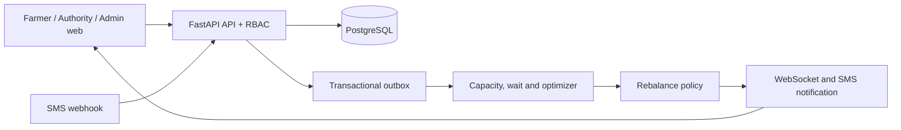

# Kish connected platform architecture

Kish keeps PostgreSQL as the source of truth. Redis is provided for production event distribution and live fan-out; the development implementation uses the same outbox event contract and in-process WebSocket hub.

The production deployment runs `docker compose up --build`. It uses PostgreSQL, Redis, the API, and the Vite web application.
