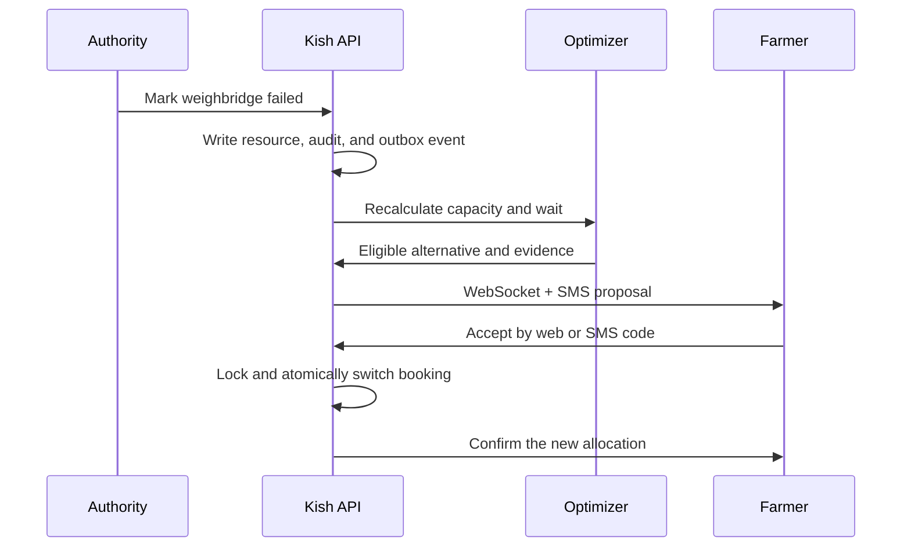

# Dynamic rebalancing

Only `CONFIRMED` and `REBALANCE_PENDING` bookings are eligible. The policy requires a configured time saving, an open alternative with a safe slot, and allowable extra travel. Accepted switches have a cooldown. Repeated SMS webhooks are idempotent.
